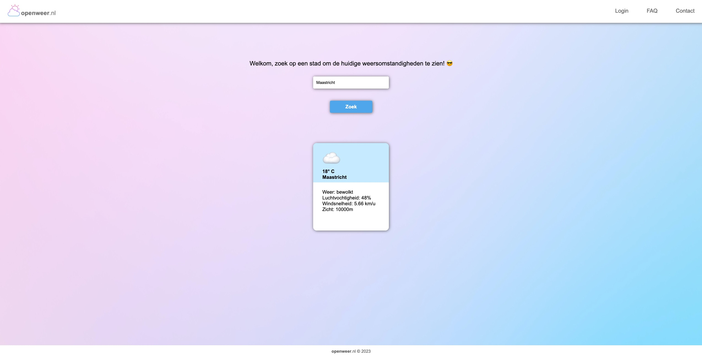

# Openweer.nl

## 1. Beschrijving

De applicatie maakt het mogelijk voor gebruikers om de weersomstandigheden 
op te zoeken. De inlogfunctionaliteit is alleen nodig voor de gebruiker als deze 
op meerdere steden tegelijkertijd wenst te zoeken. De API die gebruikt wordt 
voor de weersomstandigheden is `OpenWeather API` (https://openweathermap.org/current).

## 2. Benodigheden
### 2.1 Dependencies
1. `react`
2. `npm-router-dom`
2. `axios`
3. `jwt-decode`
4. `react-hook-form`

### 2.2 API keys
Deze API key is al reeds beschikbaar gemaakt voor de applicatie in bestand 
`.env` in de environment variable `REACT_APP_OPENWEATHER_API_KEY`.

## 3. Installatie en starten van de applicatie
1. Voer het commando `npm install` uit in de terminal om de dependencies 
en aanverwante packages uit 2.1 te installeren die vereist zijn voor de applicatie.
2. De applicatie kan gestart worden met het commando `npm start`.  Zodra 
de React applicatie volledig is opgestart is deze standaard te beanderen via:
http://localhost:3000.
3. Voor het gebruik van de **Zoek** pagina is het vereist om in te loggen op
de **Login** pagina. Er zijn geen standaard gebruikers, het is altijd noodzakelijk om 
een nieuwe gebruiker te registeren (welke aangemaakt wordt in de Novi backend). 
Deze nieuwe gebruiker zan dan enkele uren actief blijven.
